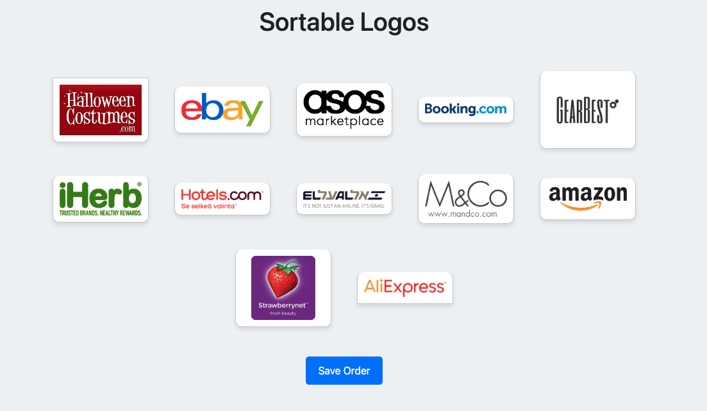

# Task 2: Sortable Logo Manager

This project is a web application for managing and sorting logos. Users can rearrange logos using drag-and-drop functionality and save their preferred order. The saved order is preserved and reloaded the next time the page is opened.

## Features

- **Sortable Logos:** Drag-and-drop logos to reorder them as you like.
- **Save Order:** Save the current order of logos to a JSON file.
- **Persistent Storage:** The order is stored and reloaded from a JSON file on the server.
- **Logging:** Separate error and info logs for better debugging and monitoring.

## Technologies Used

- **Frontend:**
  - HTML5, CSS3, Bootstrap 4
  - JavaScript, jQuery
- **Backend:**
  - PHP 7.4+
  - JSON for data storage
  - Guzzle HTTP Client for API requests (used in a related Weather Service)
- **Tools:**
  - Composer for dependency management
  - Sortable.js for drag-and-drop functionality

## Folder Structure
    task_2/
    │
    ├─── src/
    │    ├─── Config/
    │    │    └── config.php                 # Configuration file for API keys and settings
    │    │
    │    ├─── Logs/
    │    │    └── error.log                  # Error logs
    │    │    └── info.log                   # Informational logs
    │    │
    │    ├─── Public/
    │    │    ├── css/
    │    │    │    └── style.css             # Custom styles for the UI
    │    │    ├── js/
    │    │    │    └── script.js             # JavaScript for sorting functionality
    │    │    └── index.php                  # Main entry point for the application
    │    │
    │    ├─── Services/
    │    │    ├── SaveOrderService.php       # Service for saving and loading the logo order
    │    │    └── LoggerService.php          # Logging service class
    │    │
    │    ├─── Storage/
    │    │    └── order.json                 # Cached order of the logos
    │    │
    │    └─── images/                        # Images directory containing logos
    │
    ├─── vendor/                             # Composer dependencies
    │
    ├─── .gitignore                          # Git ignore file
    │
    └─── README.md                           # Project documentation
    
## Screenshots



## Setup Instructions

- **Clone the Repository:**
   ```bash
   git clone https://github.com/alexTriolla/task_2.git
   cd task_2
- **Install Dependencies:** Make sure you have Composer installed. Run the following command in the project directory:
    ```bash
    composer install
    ```
- Navigate to the Public directory
    ```bash
    cd src/Public
    ```

- Create symbolic links for images, CSS, and JS files
    ```bash
    ln -s ../../images images               # Link to the images directory
    ln -s ../Storage/order.json order.json  # Link to the order.json file in Storage
    ln -s ../Services Services              # Link to the Services directory
    ```

- **Run the Application:** Start the PHP built-in server:
    ```bash
    php -S localhost:8000 -t src/Public
    ```
- **Access the Application:** Open your web browser and go to http://localhost:8000 to see the sortable logos page.

## How to Use
- **Reorder Logos:** Drag and drop the logos to reorder them as desired.

- **Save Order:** Click the "Save Order" button to save the current order. The order will be stored in a JSON file and reloaded when the page is opened again.
